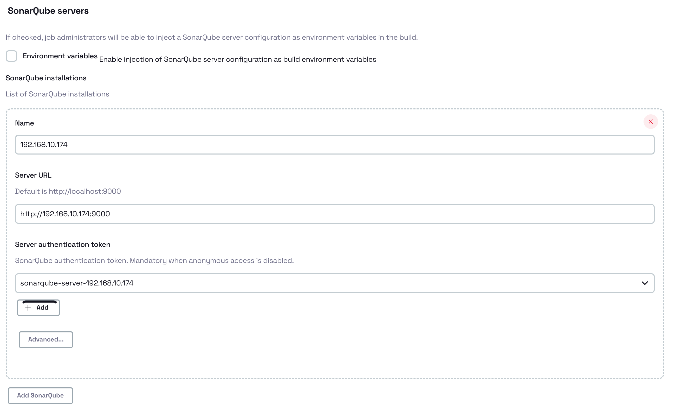
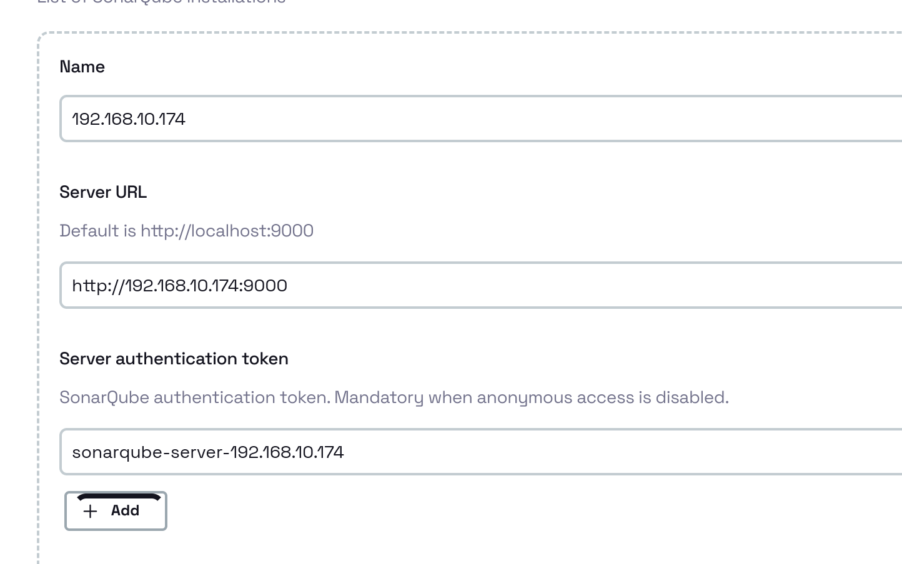
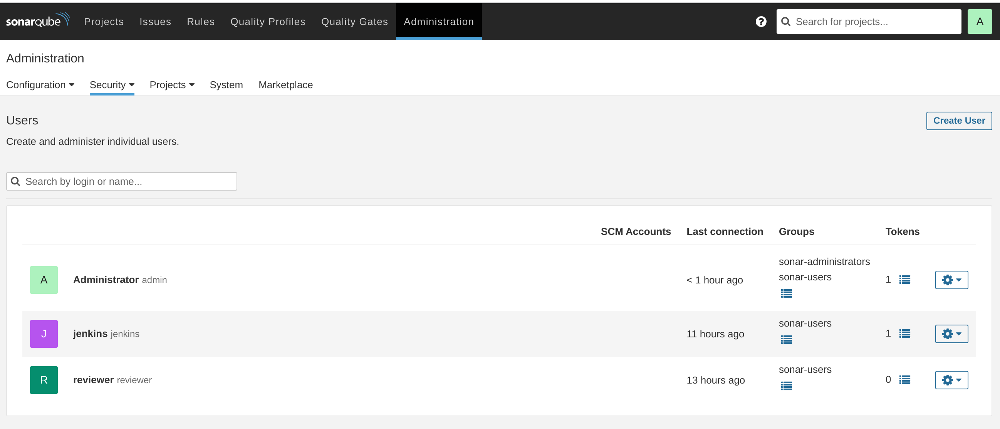
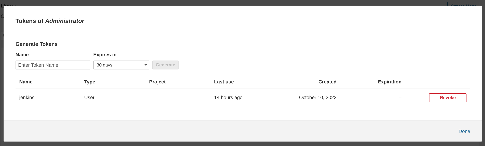
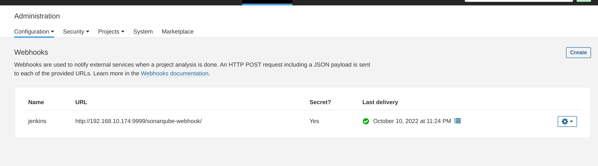
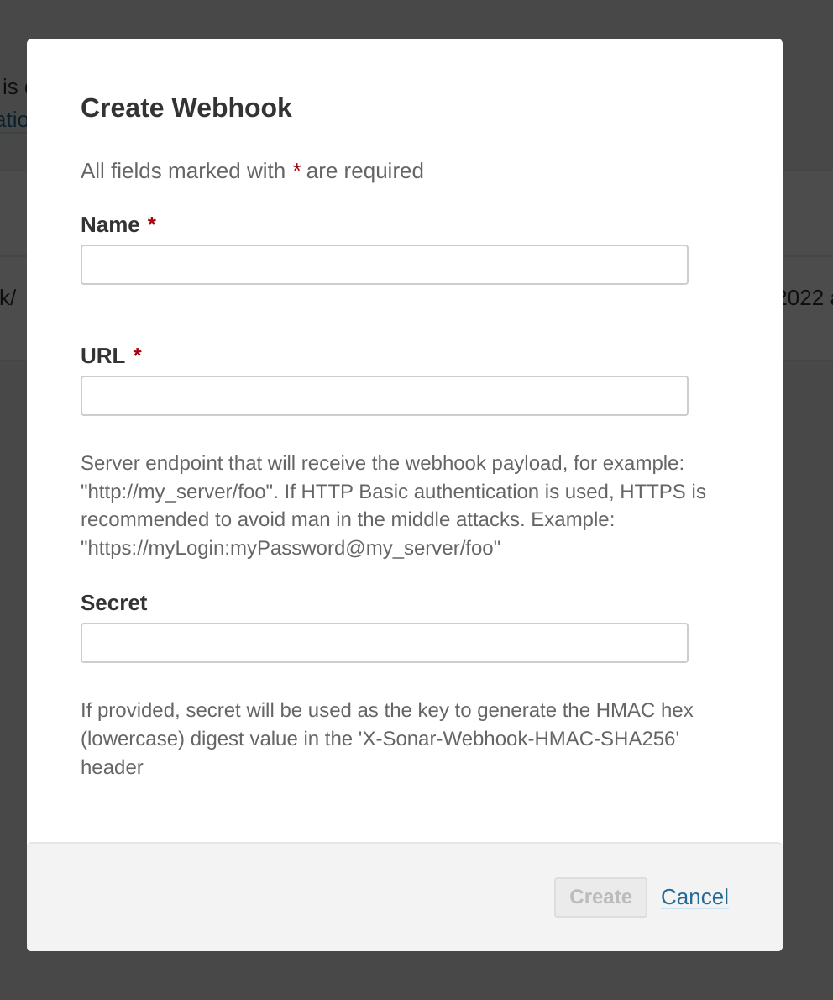

# SonarQube 集成

## 一、安装插件

`SonarQube Scanner for Jenkins`


## 二、工程配置

以下配置是配置SonarQube中的Coverage设置，让SonarQube来统来做Coverage。

```xml
<properties>
    ....
    <!-- sonarqube coverage settings -->
    <sonar.core.codeCoveragePlugin>jacoco</sonar.core.codeCoveragePlugin>
    <sonar.language>java</sonar.language>
    <sonar.java.coveragePlugin>jacoco</sonar.java.coveragePlugin>
    <sonar.sources>src/main</sonar.sources>
    <sonar.tests>src/test</sonar.tests>
    <sonar.java.binaries>target/classes</sonar.java.binaries>
    <sonar.coverage.jacoco.xmlReportPaths>target/jacoco-report/jacoco.xml</sonar.coverage.jacoco.xmlReportPaths>
</properties>
```


## 三、Jenkins 系统配置 Configure System

### 1. SonarQube基本配置 



Name：唯一标识该Server，这个标识很重要，在写Pipeline的时候就用得上：

```groovy
withSonarQubeEnv('192.168.10.174') {
    sh 'mvn clean package sonar:sonar'
}
```

Server authentication token：如果SonarQube Server做了安全控制，那么就必须指定authentication。authentication token是给jenkins访问sonarqube server的凭证。后面的内容会讲解怎么获取authentication token。

**Authentication Credentials配置要求**

1. Kind: Secret Text
2. Scope: System (Jenkins and nodes only) - 因为在Job中不会直接读取这个凭证，所以范围在System就可以了。

### 2. Webhook配置

> 在提交代码文件到SonarQube Server后，可以通过动态ID云获取检查结果（通没通过Quarlity Gate的检查），由于是异步的，所以在提交SonarQube之后等待即可：
>
> ```groovy
> timeout(time: 30) {
>     waitForQualityGate abortPipeline: true
> }
> ```

所以需要配置SonarQube Server回调Jenkins，将相关的结果反馈回来。

Jenkins - Server authentication token 配置：



SonarQube Server用的是Webhook，后续的内容会讲到。


## 三、SonarQube Server配置

### 1. 配置 SonarQube Authentication Token

`Administration` > `Security` > `Users`



在选定的用户的Token上选择`Update Tokens`



> 添加Token后会显示一次，然后就不能再次读取了，所以最好在生成好保存一下。

### 配置Webhook

> Webhook是SonarQube完成任何Task进行回调。一般为http/https地址，并且method为POST。






Webhook 地址格式为：

```
JENKINS_URL/sonarqube-webhook
```

Secret为之前在Jenkins里配的Authentication Token。