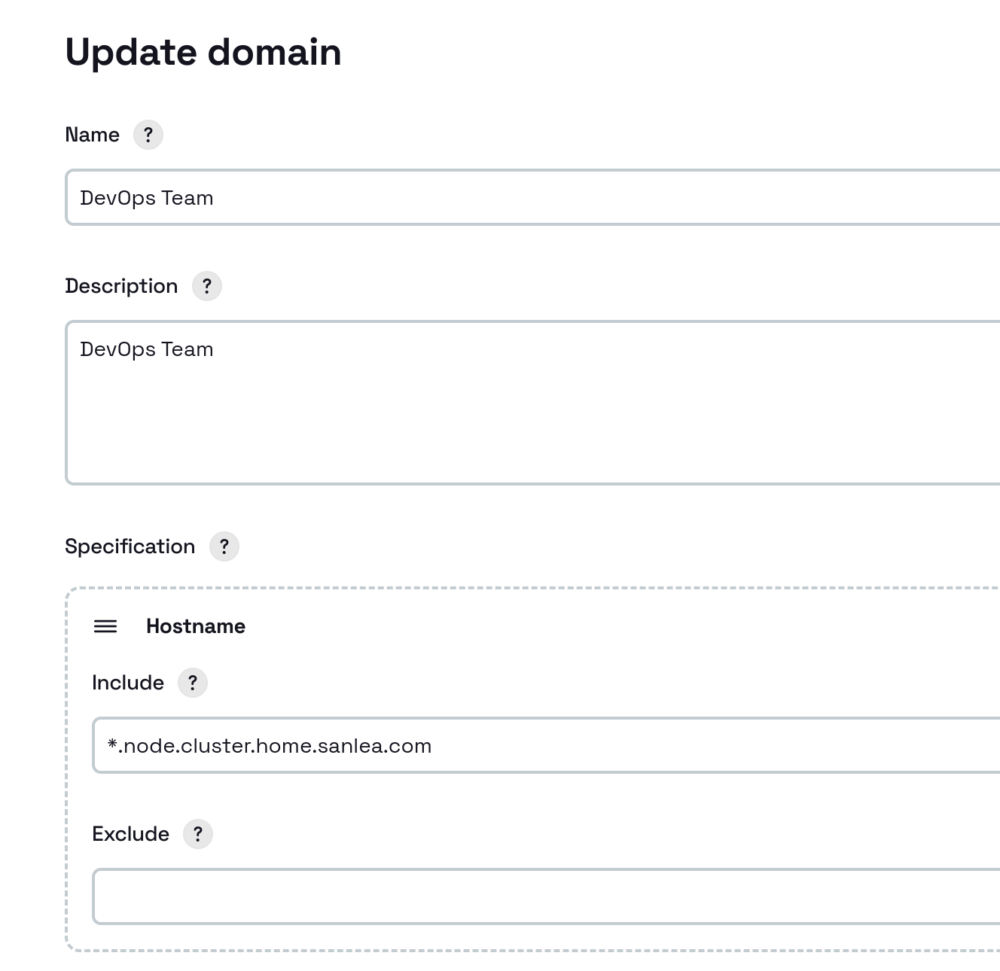
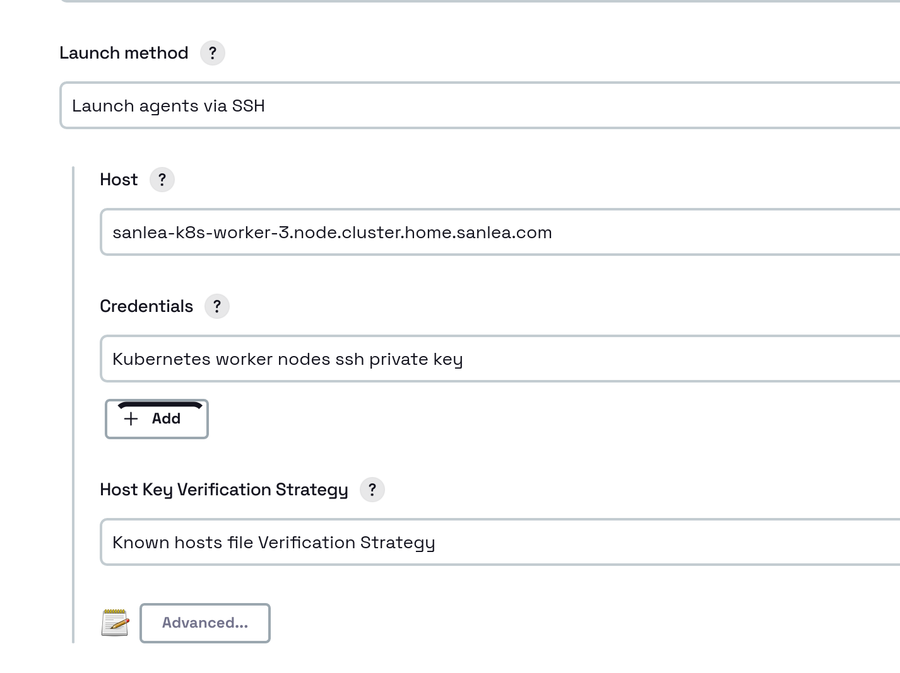
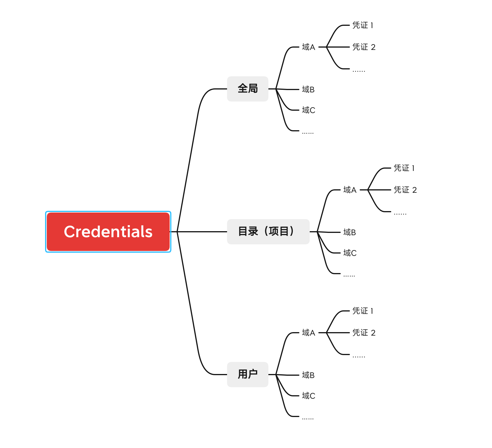

# 凭证 Credentials

## 一、什么是凭证

凭证是以下东西：

1. 登录信息－用户名、密码
2. Token
3. Cert
4. .....

## 二、Jenkins中的凭证

三种类型的凭证

### 1. 面向全局的凭证

这种凭证在整个Jenkins中都可以看到并使用。在系统管理中定义，Provider为Jenkins。

这种凭证可以用于任何地方，甚至可以用于Agent和System中。

### 2. 面向项目的凭证

这种凭证定义在目录中，仅被目录中的Jobs看到（并管理）并使用。Provider为该目录

这种凭证只能用于项目和Job

### 3. 面向用户的凭证

这种凭证定义在用户信息中，仅只能被用户自己看到（并管理），并且由用户用于想要用的地方，但是别人无法查看和修改。Provider为该用户

这种凭证可以用于项目和Job。

>**一些套路**
>
>1. 如果想创建一个凭证让全局重用，而无需太过考虑权限问题的话，可以使用面向全局的凭证，在系统管理中添加。
>2. 如果想创建一个凭证只是让一个逻辑项目组使用，那么就给这个项目组创建目录，并在该目录中创建该凭证。
>3. 如果想在项目中使用，但是又只能自己管理，别人不能修改，那么就创建个人用户的凭证。

## 三、Jenkins凭证的域

上面介绍了三种凭证类型，可以为特定的凭证类型添加凭证。

但是随着时间的推移，添加的凭证会越来越多，整个凭证列表越来越大，不好管理。

这时就要对类型中的凭证进行分组，把凭证按照用途分成不同的组，这时这个组就叫做`域`。

#### 凭证域 Spec

在定义域时可以定义域的Spec，这个Spec可以定义其Pattern，用于限制其使用范围。比如说，你定义的`hostname`的`include pattern`为`*.node.cluster.home.sanlea.com`，那么在定义agent节点时，如果节点的域名不匹配`*.node.cluster.home.sanlea.com`，那么这个域的凭证就不会被列举出来。

例子如下：

创建Node的时候，`Host`设置为`sanlea-k8s-worker-3.node.cluster.home.sanlea.com`，所以匹配上面定义的凭证，所以可以在`Credentials`下拉列表中可以被选择。

> 当然，这个Spec可以不设置，我一般都这么干，对于一个不太巨大的DevOps来说，不可能出现多域名的情况。

## 四、总结

凭证结构如下：

